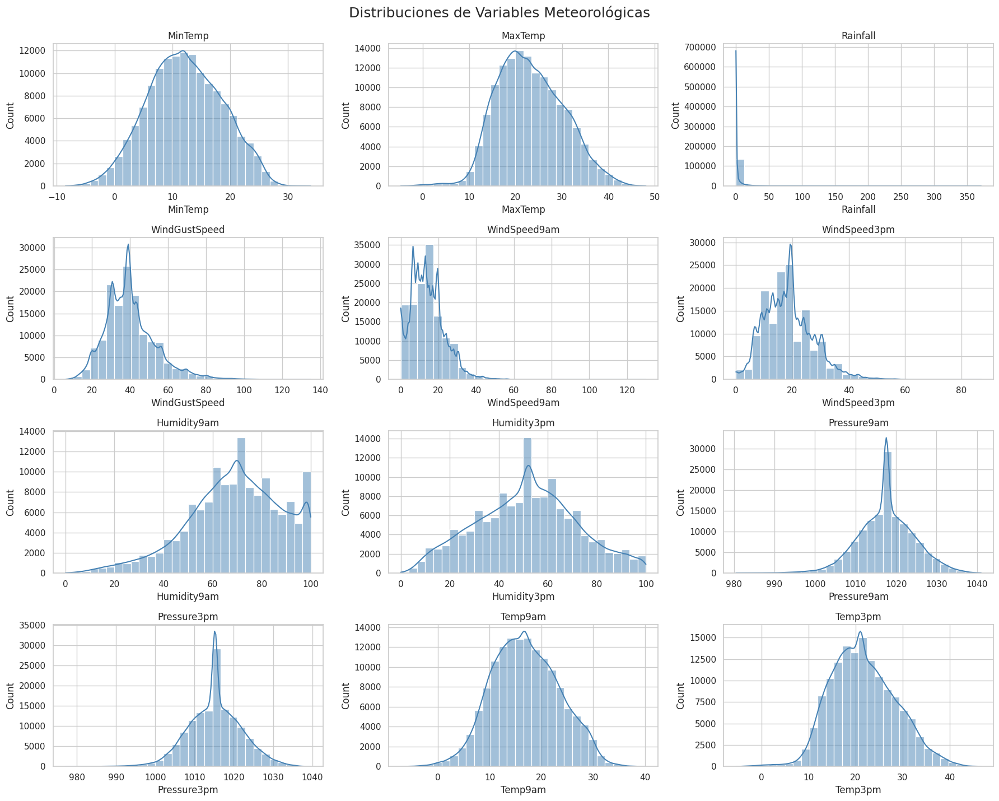
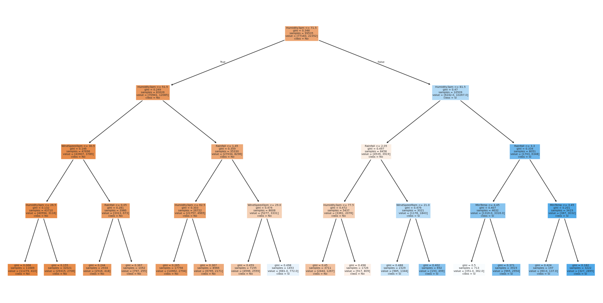
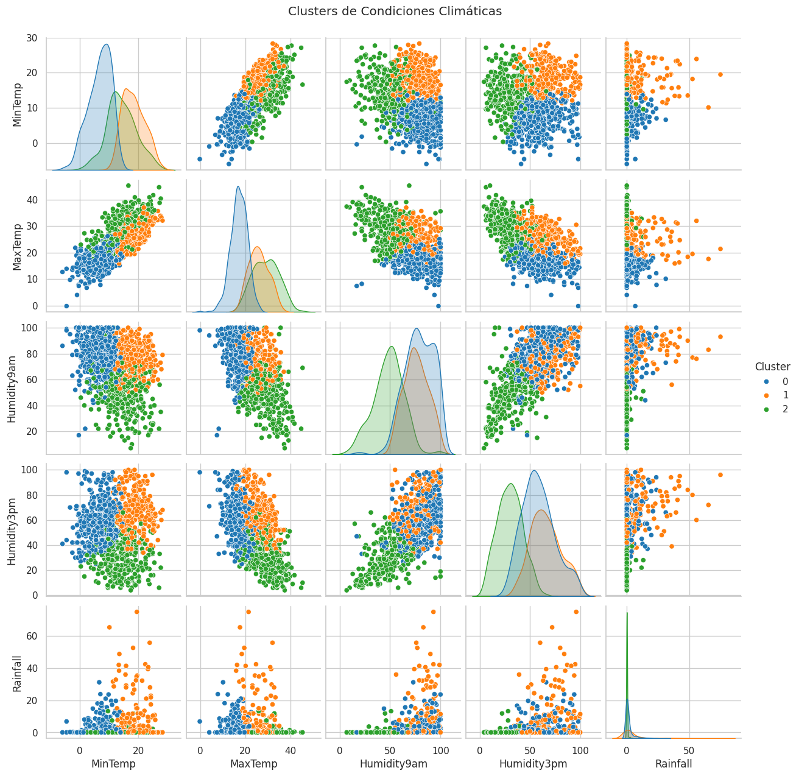

# 🌧️ ¿Lloverá Mañana?  
**Predicción Meteorológica con Minería de Datos**

Este proyecto analiza datos meteorológicos australianos para predecir si lloverá al día siguiente. Utilizamos técnicas de minería de datos como árboles de decisión y clustering para extraer patrones relevantes y generar insights aplicables.

---

## 📊 1. Exploración de Datos

Se analizaron las siguientes variables:

- Temperatura (`MinTemp`, `MaxTemp`, `Temp9am`, `Temp3pm`)
- Humedad (`Humidity9am`, `Humidity3pm`)
- Lluvia (`Rainfall`, `RainToday`, `RainTomorrow`)
- Viento (`WindGustSpeed`, `WindSpeed9am`, `WindSpeed3pm`)
- Presión (`Pressure9am`, `Pressure3pm`)

  

---

## 🤖 2. Modelos Aplicados

### 🌳 Árbol de Decisión
- Objetivo: predecir `RainTomorrow` (Sí/No)
- Variables: humedad, temperatura, viento, lluvia

### 📌 Clustering K-Means
- Segmentación de condiciones meteorológicas

---

## 💡 3. Insights Clave

- Alta humedad a las 3PM se asocia fuertemente con lluvias al día siguiente.
- Días con baja presión y alta humedad tienden a formar el cluster más lluvioso.
- El árbol permite entender qué combinación de condiciones anticipa lluvia con buena precisión.

---

## 🧠 4. Conclusiones

- Sí es posible predecir con buena certeza si lloverá mañana.
- La minería de datos permite extraer patrones climáticos útiles.
- Este enfoque puede extenderse a modelos más complejos o regiones específicas.

---

## 📂 5. Accede al Código

🔗 [Notebook en Google Colab](https://colab.research.google.com/)  
📁 También disponible en este repositorio.
